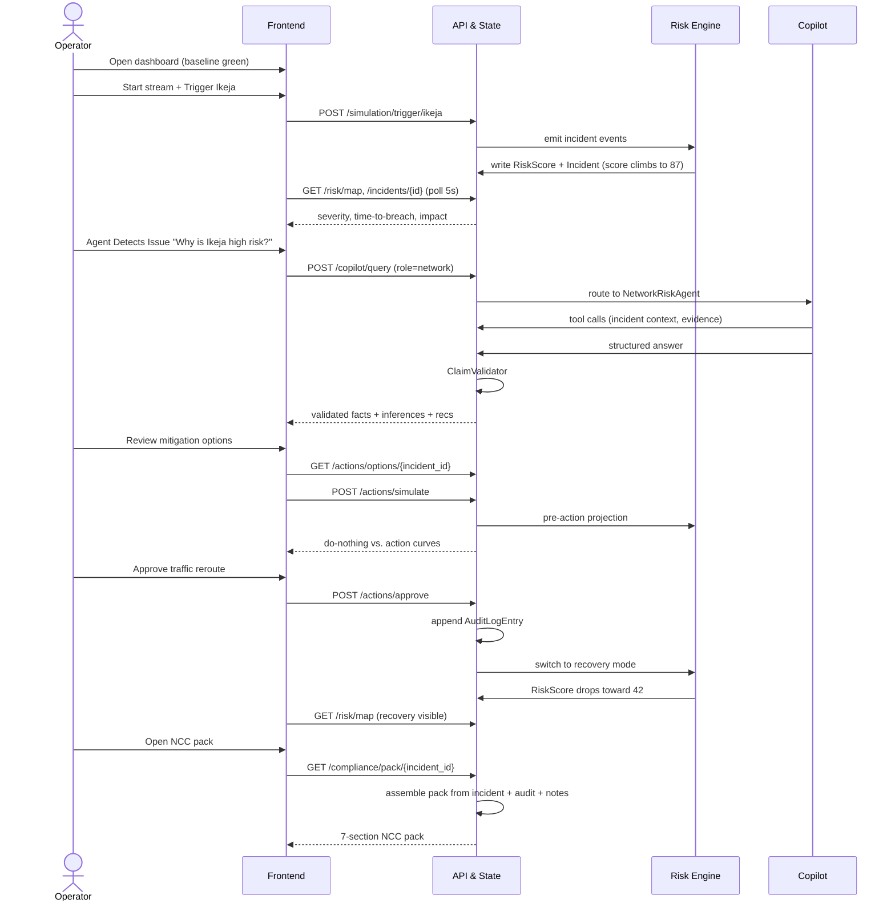
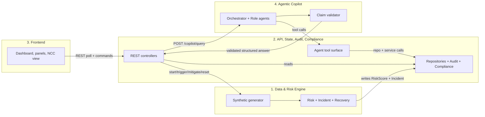

# RiskGuard AI — MVP Blueprint

This is the single document every engineer should read on Day 1, before opening their domain code. It explains what we are building this week, the demo we are telling, the four ownership domains, and exactly how those domains plug into each other.

For depth on any section, follow the links in [Section 9](#9-pointers).

---

## 1. What we are building

RiskGuard AI is an early-warning and decision-support system for operational telecom risk. The MVP detects an emerging incident in a Lagos LGA (the canonical demo is Ikeja), explains it with grounded AI agents, lets an operator compare and approve mitigation options, tracks recovery, and produces an NCC-ready evidence pack.

The MVP is a vertical slice. It must be **convincing, deterministic, and end-to-end**. It is not the production system.

---

## 2. The demo path (the one story we are telling)

This is the 8–10 minute story all four domains exist to support. If your work does not move this story forward, defer it.

The numbers (87, 42, 47 minutes to breach, 18,420 subscribers, 312 enterprise lines, NGN 8.7m revenue at risk, NGN 2.1m compensation exposure) are the demo's load-bearing facts. They come out of Engineer 1's domain and must match across the panel, the copilot answers, and the NCC pack.

---

## 3. The four domains at a glance

| Domain | Owner | Owns | Does NOT own |
|---|---|---|---|
| **1. Data & Risk Engine** | Engineer 1(Favour) | Synthetic generator, event normalization, entity resolution (LGA/cluster), feature engine, risk scoring, incident impact, recovery model | API surface, persistence, UI, agent reasoning |
| **2. API, State, Audit, Compliance** | Engineer 2(Ladipo) | FastAPI app, controllers, repositories, audit log, approval service, compliance pack assembly, agent tool surface | Risk math, UI, agent prompts |
| **3. Frontend Dashboard** | Engineer 3(Marvelous) | React shell, simulation controls, risk radar, incident panel, copilot panel, mitigation panel, NCC pack view | Any computation; renders only API shapes |
| **4. Real Agentic Copilot** | Engineer 4(Tobi) | Semantic Kernel orchestrator, role agents (SK plugins), agent tools (SK functions), Azure OpenAI client, claim validator, investigation note writer | Storage primitives, UI, risk math |

Each engineer should be able to answer two questions about their domain in one sentence: *what I produce* and *who consumes it*.

---

## 4. How the domains connect

This is the most important section. Every cross-domain interaction in the MVP goes through one of the four seams below.

### 4.1 Risk Engine ↔ API/State (Engineer 1 ↔ Engineer 2)

- **Direction:** API/State *triggers* the engine via `SimulationController`. The engine *writes* its outputs through repository interfaces owned by Engineer 2.
- **Engine consumes (provided by Engineer 2):** `RiskScoreRepository.upsert(...)`, `IncidentRepository.upsert(...)`, `IncidentRepository.set_phase(...)` (active/recovery), `SignalEventRepository.append(...)`.
- **API consumes (provided by Engineer 1):** `SyntheticEventGenerator.start()`, `.trigger_ikeja()`, `.enter_recovery()`, `.reset()`; `RiskScoringEngine.score(lga_id)`; `IncidentImpactBuilder.build(incident_id)`; `RecoveryModel.tick()`.
- **Rule:** Engineer 1 never touches FastAPI, never imports controllers. Engineer 2 never reaches into feature math.

### 4.2 API/State ↔ Frontend (Engineer 2 ↔ Engineer 3)

- **Direction:** Frontend calls REST. It renders only the shapes the API returns. No client-side risk math, no client-side aggregation that the API doesn't already do.
- **Endpoints:**
  - `GET  /me` — operator badge (id, name, role). Stubbed for the demo; populates the header.
  - `POST /simulation/start`
  - `POST /simulation/trigger/ikeja`
  - `POST /simulation/mitigate`
  - `POST /simulation/reset`
  - `GET  /risk/map`
  - `GET  /incidents/{incident_id}`
  - `POST /copilot/query`
  - `GET  /actions/options/{incident_id}` — list of `MitigationOption` from the playbook for that risk type.
  - `POST /actions/simulate` — projected score curves for selected options vs. do-nothing baseline.
  - `POST /actions/approve`
  - `GET  /compliance/pack/{incident_id}`
- **Polling cadence:** 5 seconds for `/risk/map` and the active `/incidents/{id}`. All other reads are on-demand. **Day 5 stretch:** swap `/risk/map` polling for a single websocket channel (`WS /risk/stream`) to make recovery feel real-time on stage.
- **Rule:** Response shapes are locked on Deliverable 1. The frontend codes against mocked responses with the locked shape until Engineer 2 wires the real path.

### 4.3 API/State ↔ Agentic Copilot (Engineer 2 ↔ Engineer 4)

- **Stack.** The copilot is built on the **Semantic Kernel SDK** with **Azure OpenAI** as the chat completion service. Each role agent is a Semantic Kernel plugin; each tool is registered as a kernel function with a JSON schema.
- **Direction:** The copilot consumes API/State as a **tool surface** (kernel functions), not as REST. The frontend reaches the copilot through `POST /copilot/query`; the copilot reaches the system through SK function invocations that resolve to Engineer 2's repositories and services.
- **Tool surface (provided by Engineer 2, registered by Engineer 4 as SK functions):**
  - `get_incident_context(lga_id)`
  - `get_signal_evidence(lga_id, domains=[...])`
  - `estimate_impact(incident_id)`
  - `get_mitigation_playbook(risk_type)`
  - `run_pre_action_simulation(incident_id, action_ids)`
  - `get_audit_trail(incident_id)`
  - `generate_ncc_pack_draft(incident_id)`
  - `validate_claims_against_context(text, context_id)`
  - `write_investigation_note(incident_id, agent_role, summary, evidence_ids)`
- Each tool resolves to a repository call or service call already owned by Engineer 2. The copilot does not see SQL, files, or raw CSVs.
- **Output contract:** Every agent returns the structured JSON shape (facts, inferences, recommendations, tools_called, validation_status). API/State runs `ClaimValidator` on the output before it returns to the caller.
- **Rule:** No agent answers without at least one tool call. No claim about a KPI, money, subscriber count, site, or action survives validation unless it traces to a tool result.

### 4.4 Frontend ↔ Copilot (indirect, through API)

The frontend never calls the copilot directly. It calls `POST /copilot/query` with `{role, query, incident_id}` and renders the validated structured response. This keeps validation server-side and the frontend dumb.

---

## 5. Shared contracts cheat sheet

These are the data shapes that cross domain boundaries. Engineer 2 publishes them as Pydantic models on Deliverable 1; everyone imports from there.

| Shape | Producer → Consumer | Purpose |
|---|---|---|
| `SignalEvent` | Generator → Risk engine | Canonical normalized stream record across **network, BTS, billing, sales, recharge, complaints, device sessions**, including KPI value, baseline, deviation, source system, correlation key, and evidence id. |
| `FeatureWindow` | Risk engine internals → scoring/prediction | Rolling feature state per LGA/KPI: z-score, delta, anomaly score, sample count, and optional time-to-breach estimate. |
| `SignalEvidence` | API/State tools → Copilot | Agent-facing normalized evidence summary. The copilot reads this instead of raw stream rows. |
| `RiskScore` | Risk engine → API/State → Frontend | Per-LGA score, severity, confidence, time-to-breach. |
| `Incident` | Risk engine → API/State → Frontend, Copilot | Cause, affected subscribers, enterprise lines, revenue at risk, NCC exposure, phase. |
| `MitigationOption` | Playbook → API/State → Frontend, Copilot | Action id, name, description, expected risk delta, est. cost, time-to-effect, side effects, source playbook. |
| `MitigationPlaybook` | Engineer 1 fixture → API/State | Risk type → ordered list of `MitigationOption`. Static for the demo; pluggable in production. |
| Agent structured output | Copilot → API/State → Frontend | Facts, inferences, recommendations, tools_called, validation_status. |
| `Operator` | `/me` → Frontend | Operator id, name, role (e.g. *Network Ops*, *Compliance Officer*). Stubbed for the demo, drives the badge and the audit log's `operator` field. |
| `AuditLogEntry` | Approval service → Audit repo → Compliance | Operator, timestamp, action, expected impact, rationale. |
| `NCCPack` | Compliance service → Frontend | Seven sections: timeline, affected services, KPIs, impacted subscribers, root cause, corrective actions, evidence logs. |

If a shape changes, Engineer 2 announces it; everyone else updates.

---

## 6. Sequencing — what each domain needs from another, and when

This maps the dependency graph onto the day-by-day plan. If you are blocked, the most likely cause is here.

| Deliverable | Engineer 1 (Risk) | Engineer 2 (API) | Engineer 3 (FE) | Engineer 4 (Copilot) |
|---|---|---|---|---|
| **1** | Fixtures for Ikeja baseline | **Publishes API shapes + tool schemas** | Builds layout against mocks | Orchestrator skeleton, mocked tools |
| **2** | Real generator + risk + incident path | Wires risk/incident endpoints | Real polling, real incident panel | Swap mocked tools for real read tools |
| **3** | Pre-action simulation hook | Action simulate endpoint | Mitigation panel | Role agents + claim validator |
| **4** | Recovery model | Approval + audit log + compliance pack | NCC pack view | Investigation note writer |
| **5** | Calibration | Bug fixes, perf | Polish, loading/error states | Demo rehearsal |

**Deliverable 1 is the keystone.** If API shapes and tool schemas are not locked by end of Deliverable 1, every other domain blocks.

---

## 7. Per-engineer Instructions

If you read only one section, read your own. Each engineer has a goal, day-by-day deliverables, who they depend on, who depends on them, a definition of done, and a list of things to explicitly *not* do.

### 7.1 Engineer 1 — Data & Risk Engine

**Goal.** Be the source of truth for the Ikeja story. Generate the events, compute the score, build the incident, drive recovery — all deterministically.

**Deliverables**

- **Deliverable 1.** Lock Ikeja fixtures (LGA IDs, BTS list, baseline KPIs). Stub `SyntheticEventGenerator` exposing `start()`, `trigger_ikeja()`, `enter_recovery()`, `reset()`. Agree with Engineer 2 on `SignalEvent`, `FeatureWindow`, `SignalEvidence`, `RiskScore`, and `Incident` Pydantic shapes.
- **Deliverable 2.** Real generator producing baseline and Ikeja-mode events. `EventNormalizer`, `EntityResolver`, `FeatureEngine` (rolling z-scores, deltas, co-occurrence). `RiskScoringEngine` writing through `RiskScoreRepository`. `IncidentImpactBuilder` writing through `IncidentRepository`.
- **Deliverable 3.** `run_pre_action_simulation(incident_id, action_ids)` projecting score curves per action vs. do-nothing.
- **Deliverable 4.** `RecoveryModel` triggered by approval; score moves toward 42 over the recovery window.
- **Deliverable 5.** Calibration. Lock the numbers: peak 87, time-to-breach 47 min, 18,420 subscribers, 312 enterprise lines, NGN 8.7m revenue at risk, NGN 2.1m compensation, recovery floor 42.

**You depend on:** Engineer 2 publishing repository interfaces and shared shapes by end of Deliverable 1.

**Others depend on you for:** Deliverable 2 — real risk path (unblocks Engineers 2, 3, 4). Deliverable 3 — pre-action simulation (unblocks Engineer 4's mitigation agent). Deliverable 4 — recovery (unblocks Engineer 3's before/after view).

**Done when.** Trigger Ikeja → score climbs to exactly 87. Incident detail returns the locked numbers. Approve mitigation → score recovers toward 42. All numbers are reproducible across runs.

**Do not.** Touch FastAPI, controllers, or storage primitives. Add ML libraries (Isolation Forest, SHAP) or training pipelines. Support any incident other than Ikeja.

### 7.2 Engineer 2 — API, State, Audit, Compliance

**Goal.** Be the contract layer. Lock shapes on Deliverable 1, expose stable REST and tool surfaces, keep audit append-only, assemble the NCC pack.

**What you actually own**

- **Public REST endpoints for the frontend.** These are the routes Engineer 3 calls directly:
  - `GET /me` — returns the current demo operator for the header badge and audit context.
  - `POST /simulation/start` — switches the system into baseline streaming mode.
  - `POST /simulation/trigger/ikeja` — triggers the canonical Ikeja incident path.
  - `POST /simulation/mitigate` — moves the simulation toward mitigation/recovery mode when the approved action flow is exercised.
  - `POST /simulation/reset` — resets demo state back to clean baseline.
  - `GET /risk/map` — returns the current LGA risk view for the map/list.
  - `GET /incidents/{incident_id}` — returns the active incident detail panel payload.
  - `POST /copilot/query` — accepts `{role, query, incident_id}` and returns validated structured copilot output.
  - `GET /actions/options/{incident_id}` — returns mitigation options from the relevant playbook for operator comparison.
  - `POST /actions/simulate` — returns projected outcome curves for selected options vs. do-nothing.
  - `POST /actions/approve` — records operator approval, appends audit, and triggers recovery.
  - `GET /compliance/pack/{incident_id}` — returns the assembled NCC-ready evidence pack.
- **Internal backend services and state.** These are backend features, not frontend routes:
  - `SimulationController` — translates frontend simulation commands into calls into Engineer 1's generator/runtime.
  - `RiskController` — reads materialized risk and incident state and shapes it for the UI.
  - `CopilotController` — validates the copilot request/response contract and keeps validation server-side.
  - `ActionController` — coordinates option lookup, simulation requests, and approval flow.
  - `ApprovalService` — owns the human-approval gate; no recovery starts without passing through here.
  - `CompliancePackService` — assembles the seven-section NCC pack from incident state, audit history, and validated notes.
  - `Repositories` — persistence contracts for risk state, incidents, audit log, playbooks, and pack storage.
- **Agent-only tool surface for Engineer 4.** These are not public UI routes. They are backend functions exposed to Semantic Kernel:
  - `get_incident_context(lga_id)` — returns the normalized incident summary and key identifiers.
  - `get_signal_evidence(lga_id, domains=[...])` — returns supporting evidence across selected signal domains.
  - `estimate_impact(incident_id)` — returns operator-facing impact numbers such as subscribers, revenue, and compliance exposure.
  - `get_mitigation_playbook(risk_type)` — returns the ordered mitigation options for the incident type.
  - `run_pre_action_simulation(incident_id, action_ids)` — runs comparison projections for one or more candidate actions.
  - `get_audit_trail(incident_id)` — returns approved actions and related timeline evidence.
  - `generate_ncc_pack_draft(incident_id)` — returns draft compliance pack content for the compliance agent.
  - `validate_claims_against_context(text, context_id)` — checks whether narrative claims are grounded in structured context.
  - `write_investigation_note(incident_id, agent_role, summary, evidence_ids)` — persists validated agent notes for pack/timeline use.

**Important boundary.** Ladipo owns both the REST layer and the backend contract layer. That does **not** mean every backend feature is a route. Frontend-facing actions are routes; agent-facing capabilities are tools; state coordination lives in services and repositories.

**Deliverables**

- **Deliverable 1.** Publish Pydantic models: `SignalEvent` (with the seven signal domains including `sales`), `FeatureWindow`, `SignalEvidence`, `RiskScore`, `Incident`, `MitigationOption`, `MitigationPlaybook`, `Operator`, agent output, `AuditLogEntry`, and `NCCPack`. Stub all endpoints (including `GET /me` and `GET /actions/options/{incident_id}`) with locked response shapes. Define the agent tool schemas. Skeleton repositories (in-memory or SQLite).
- **Deliverable 2.** Wire real risk endpoints: `SimulationController` → generator; `RiskController` → `RiskScoreRepository` / `IncidentRepository`. Stub `GET /me` returning a fixed `Operator`.
- **Deliverable 3.** `GET /actions/options/{incident_id}` reading from the playbook fixture. `POST /actions/simulate` endpoint. Real read tools backing the copilot tool surface (`get_incident_context`, `get_signal_evidence`, `estimate_impact`).
- **Deliverable 4.** `POST /actions/approve` + append-only audit log (operator from `/me`) + recovery trigger. Remaining tools (`get_mitigation_playbook`, `run_pre_action_simulation`, `get_audit_trail`, `generate_ncc_pack_draft`, `validate_claims_against_context`, `write_investigation_note`). Compliance pack assembly.
- **Deliverable 5.** Bug fixes and perf (p99 < 300ms for dashboard/incident reads, pack < 10s). Stretch: `WS /risk/stream` to replace the 5s `/risk/map` poll.

**You depend on:** Engineer 1 confirming engine method signatures by end of Deliverable 1.

**Others depend on you for:** **End of Deliverable 1 — locked API shapes and tool schemas. If this slips, every other domain blocks.** Deliverable 2 — working risk endpoints. Deliverable 3 — simulate endpoint and read tools. Deliverable 4 — approval, audit, compliance pack, write tools.

**Done when.** All demo endpoints work against the story path (`/me`, simulation commands, risk reads, copilot query, action options/simulate/approve, compliance pack). Approval writes an `AuditLogEntry` and triggers recovery via the engine. Pack returns 7 sections in under 10 seconds. `ClaimValidator` runs server-side on every copilot response.

**Do not.** Implement risk math. Render UI. Call LLMs from controllers (that's Engineer 4's copilot stack via Semantic Kernel). Edit or delete from the audit log.

### 7.3 Engineer 3 — Frontend Dashboard

**Goal.** Make the demo legible to a judge without explanation. The UI is the story.

**Deliverables**

- **Deliverable 1.** App shell, single demo route, API client. Build the layout against mocked responses that match Engineer 2's locked shapes. Risk radar/list, simulation controls, and empty incident/copilot/mitigation/NCC panels.
- **Deliverable 2.** Real polling for `/risk/map` and `/incidents/{id}` at 5s. Incident panel renders cause, time-to-breach, affected subscribers, revenue at risk, NCC exposure.
- **Deliverable 3.** Copilot panel: role selector, query input, validated structured-answer renderer (facts, inferences, recommendations as separate visual blocks). Mitigation panel: ranked actions, do-nothing baseline, projected curves, approval button.
- **Deliverable 4.** Before/after recovery view. NCC pack view rendering all seven sections.
- **Deliverable 5.** Loading and error states. Visual polish. Three rehearsals.

**You depend on:** Engineer 2's locked shapes by end of Deliverable 1. Engineer 1's calibrated numbers reaching real endpoints by Deliverable 2. Engineer 4's validated copilot output shape by Deliverable 3.

**Others depend on you for:** Nothing blocking — you are the consumer. But the demo is judged on what you ship.

**Done when.** A judge follows green → red → mitigation → recovery → pack purely visually, with no console explanation. Every demo step works end-to-end without dev fixes.

**Do not.** Compute anything. No client-side aggregation, no client-side risk math. Never call the copilot directly — always through `POST /copilot/query`. Build features outside the demo path.

### 7.4 Engineer 4 — Real Agentic Copilot

**Goal.** Make the copilot real, not theatrical. Every answer is the product of tool calls plus validation.

**Deliverables**

- **Deliverable 1.** Define agent structured-output schema jointly with Engineer 2. Build a `SemanticKernelOrchestrator` skeleton routing role → role plugin. Configure Azure OpenAI chat completion in Semantic Kernel and register placeholder SK functions for the tool surface. All five role plugins stubbed, returning canned structured output.
- **Deliverable 2.** Replace placeholder functions with real read tools (`get_incident_context`, `get_signal_evidence`, `estimate_impact`) registered as SK functions.
- **Deliverable 3.** All five role agents calling real tools. `ClaimValidator` rejects unsupported KPI / money / subscriber / site / action claims. Lock the canonical demo questions: *Why is Ikeja high risk? / Are there revenue leakage signals? / How many subscribers are affected? / What should we do now? / What is our NCC exposure?*
- **Deliverable 4.** `MitigationPlanningAgent` calls `get_mitigation_playbook` and `run_pre_action_simulation` *before* recommending. `ComplianceAgent` calls `get_audit_trail` and `generate_ncc_pack_draft`. `InvestigationNoteWriter` writes validated agent summaries that surface in the pack.
- **Deliverable 5.** Demo question rehearsal. Lock prompts so output is deterministic enough to demo.

**You depend on:** Engineer 2 — tool schemas Deliverable 1, read tools Deliverable 2, simulation tool Deliverable 3, audit/pack-draft/note-writer Deliverable 4.

**Others depend on you for:** Deliverable 3 — working copilot answers (Engineer 3's panel renders them). Deliverable 4 — investigation notes that surface in the NCC pack.

**Done when.** Every demo agent calls at least one real SK function before answering. `ClaimValidator` rejects an obviously fabricated claim in tests. Mitigation agent retrieves a playbook and runs a simulation before recommending. Compliance agent's notes appear in the rendered NCC pack.

**Do not.** Let agents inspect raw CSVs or arbitrary data. Add a sixth role agent. Build autonomous loops or multi-agent debate. Allow free-form Q&A outside the canonical demo questions on the demo path.

---

## 8. Guardrails (the things we will not relax)

These come from the functional and non-functional requirements. They are not negotiable for the demo.

- **Deterministic Ikeja path.** The risk engine is calibrated so trigger always reaches 87, mitigation always recovers toward 42.
- **Copilot answers only from structured context.** Agents never inspect raw CSVs or arbitrary databases.
- **Every named claim traces to a tool result.** KPIs, money, subscriber counts, sites, actions — if it's in the answer, it came from a tool. Otherwise the validator strips or rejects it.
- **No automated mitigation.** Human approval is mandatory. The audit entry is the only path that switches the engine to recovery.
- **Append-only audit log.** Never edit, never delete.
- **Offline demo.** No real MTN integrations, no real customer PII. Synthetic data only.
- **Hackathon stack alignment.** Copilot runtime uses Semantic Kernel with Azure OpenAI.

If you are about to break one of these to ship faster, stop and escalate.

---

## 9. Pointers

- [`Comprehensive reqs.md`](./Comprehensive%20reqs.md) — what users must be able to do; non-functional targets.
- [`MVP_PLAN.md`](./MVP_PLAN.md) — full scope, capacity, day-by-day plan, agent runtime details, cut line.
- [`docs/architecture/mvp_engineering_domains.md`](architecture/mvp_engineering_domains.md) — per-domain component lists.
- `docs/architecture/riskguard-mvp-engineering-domains.excalidraw` — visual ownership view.
- `docs/architecture/riskguard-modules-classes.excalidraw` — module and class interaction view.
- `docs/architecture/riskguard-infrastructure.excalidraw` — infrastructure and data-flow view.
